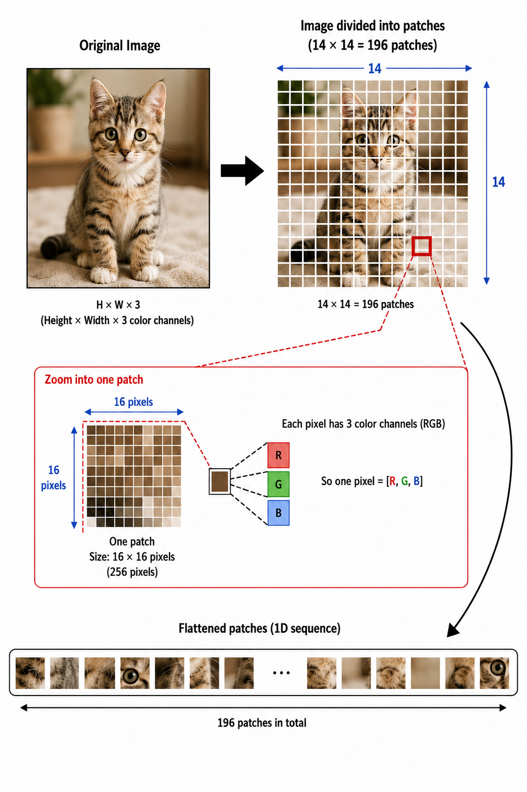
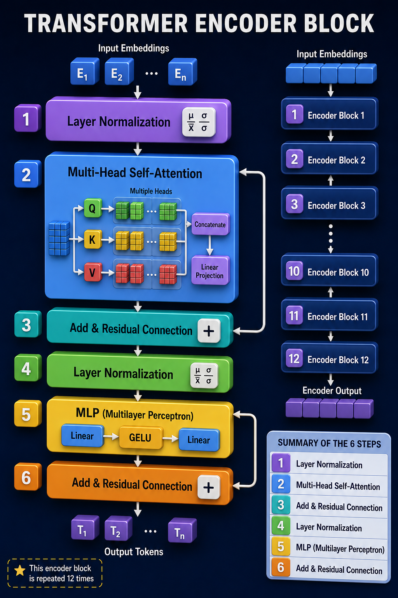
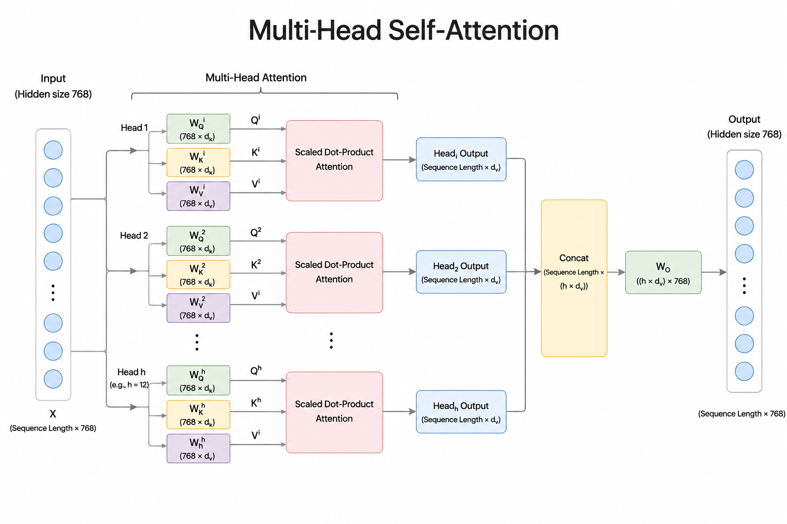
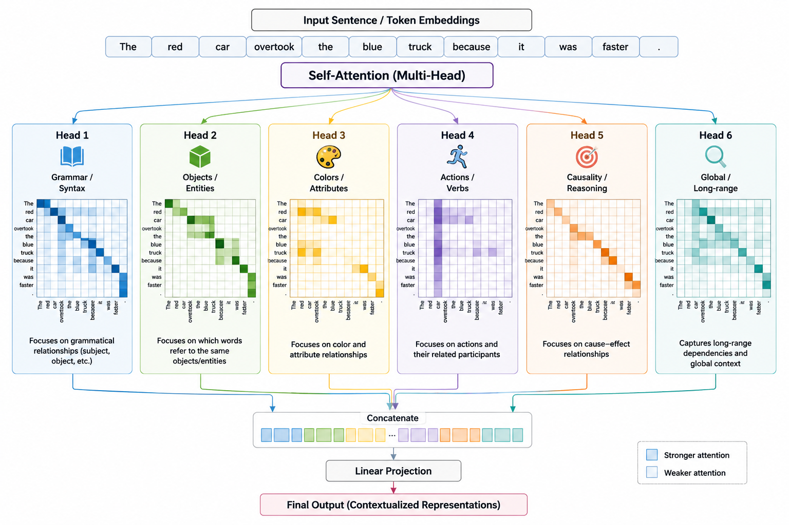
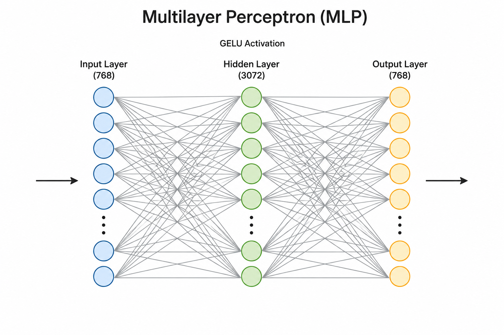
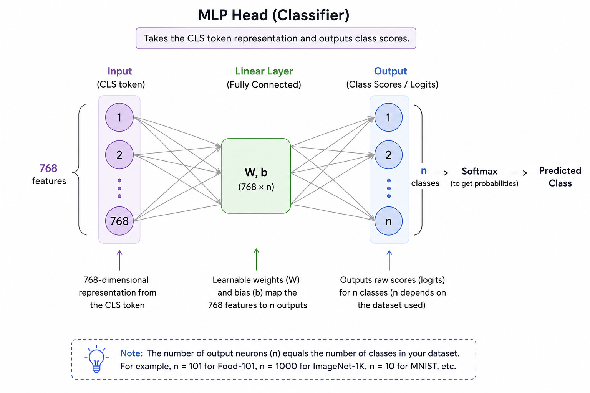
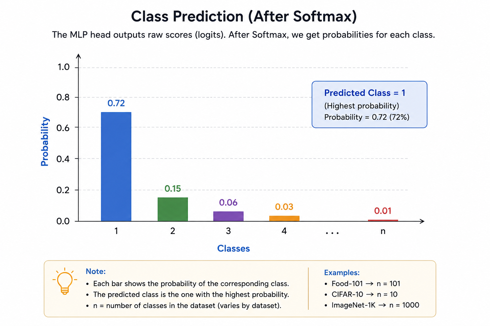
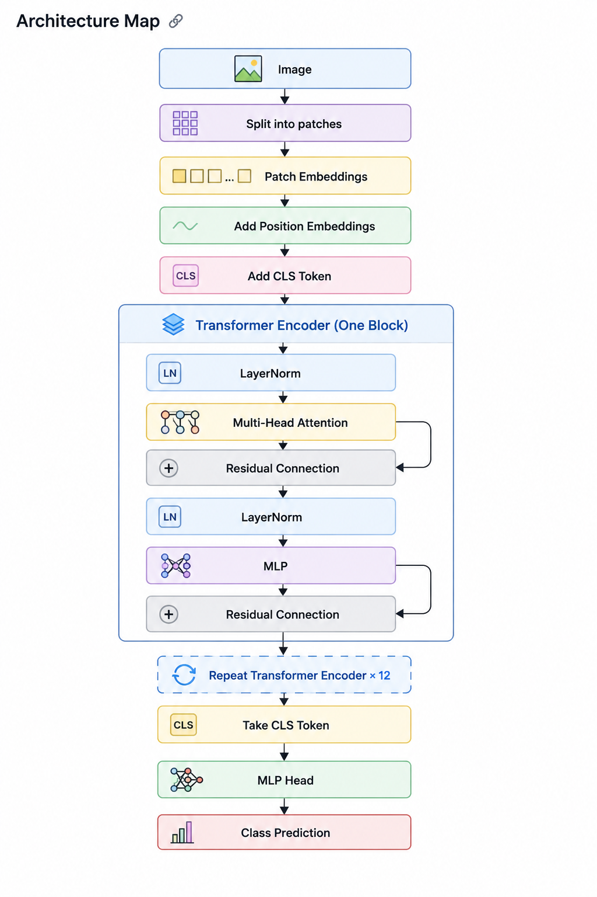
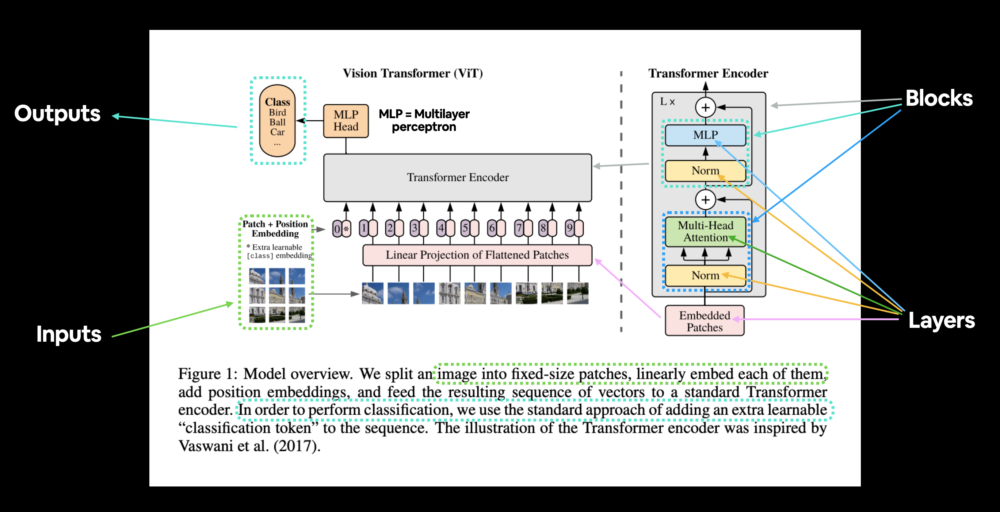
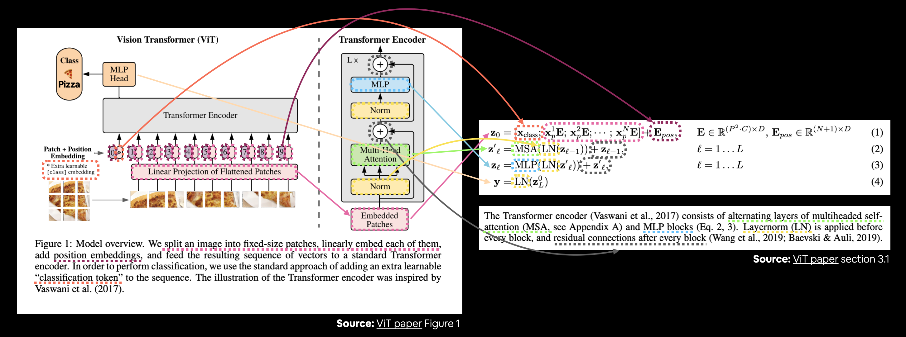

# Understanding and replicating the ViT (Vision Transformer) Research Paper 

## Introduction

[`An Image is Worth 16 x 16 Words : Transformers for Image Recognition at Scale`](https://arxiv.org/abs/2010.11929) was a research paper published by Google Brain in 2020. I can feel the pain of many beginners: "This research paper is very hard to interpret, I am not understanding a single thing 😭... somebody please explain this!". So here I am...😎 I'll explain almost everything in plain language while keeping the important details intact. I've also explained some concepts which other tutorials simply replace with a hyperlink and expect readers to figure out their own. **Why fear when I am here?** 😎

!!! Note "NOTE"
    * This research paper explainer is written by a **15 years old student**, not by a superhuman (professional). I've also used AI to fact-check the explanations, so there shouldn't be any major factual mistakes. Don't judge this explanation by my age. Judge it by how much you understand after reading it. 😄

    * Already understand this paper? Just here for a quick revision? 😄 Then I recommend jumping directly to the section: [A walk through the ViT architecture: Short Version](#short-walk).

!!! abstract "After reading this explainer, you will understand"
    Theory:

    - Why ViT splits an image into patches.
    - What patch embeddings are.
    - Why positional embeddings are needed.
    - How self-attention works.
    - Why there is a CLS token.
    - What happens inside a Transformer Encoder block.
    - How the MLP Head predicts the final class.
    - The intuition behind all four equations.

    Code replication:

    - bla bla bla
  

## Acknowledgements
* Big shout out to **Daniel Bourke** and his PyTorch course for the development of this paper explainer. I have used some of his figures, and also mentioned in the caption. This explainer exists because his course sparked my interest. Again, big shout out to him!

* Big shout out to OpenAI's ChatGPT for the generation of intuitive diagrams, which are used throughout this paper explainer. Almost every image (except for some which I have mentioned) is generated by ChatGPT. ChatGPT has also helped in fact-checking and understanding many concepts throughout this paper explainer. Again, big thanks to ChatGPT!

## **Part 1: Understanding the ViT paper** {part-1}
We'll understand the paper first, and in Part 2, we will see the code implementation.

## 0. A walk through the ViT architecture : Long-Version {#long-walk} 

This is an intuitive walk through the ViT architecture that explains how an image is actually classified...

!!! info "Did you know?"

    ViT was one of the first models to show that Transformers could replace CNNs (Convlutional Neural Networks) for image recognition.

### 0.1. Converting the image into 196 patches and those 196 patches into 196*768 numbers {#images-to-patches}

<figure markdown>

  

  <figcaption markdown>
  Figure 1: The image gets sliced into 196 (14*14) patches. Each patch is made up of 256 (16*16) pixels. Each pixel has 3 color channels (R-G-B). The 196 patches are flatten before entering the transformer.
  </figcaption>
</figure>

The image above tells everything. But still I am explaining the whole process:
<pre>
We have an image
       ↓
Slice that image into 196 (14*14) patches (each patch = 16*16 pixels).
       ↓
Now each patch is of 256 (16*16) pixels and it has 3 color channels (R,G,B).
So the tensor (for each patch) might look like:
                -|
[[81, 34, 230],  |
 [32, 147, 77],  |
 [83, 76, 152],  |  (256)
 ...             | 
 [72, 66, 120]]  |
                -|
</pre>
So total numbers for each patch = $16 * 16 * 3 = 768$ numbers
Total numbers for 196 patches = $196 * 768 = 150528$ numbers!

### 0.2. Positional Embedding {#pos-embedding-example}

Now we add a positional element to each patch to remember their position. See [positional embedding](#pos-embedding).

!!! Note "Note"
    Adding a positional element to each patch doesn't mean to append (I mean it won't increase the amount of numbers each patch carries, i.e. it won't increase 768 to say 780). Positional embedding is done in a way that it changes those 768 numbers (instead of adding more numbers to store position).

    For example:
    If I say that the temperature is 25 degree celsius. And then tell you that altitude correction is +2 degree celsius, then you won't store the temperature like (25, 2), you will simply say that the temperature is 27 degree celsius now.

    Same here, positional embedding doesn't append anything.

### 0.3. Add CLS token {CLS-token-example}

See [CLS token](#cls-token). Each patch is called a token. So there are 196 tokens. After adding CLS token, there are 197 tokens. Note that CLS token also has 768 numbers like every patch.

### 0.4. Inside the Transformer Encoder Block {#transformer-block-example}

Now here comes the Transformer Encoder Block. Let's understand it deeply.

<figure markdown>

  
  <figcaption markdown>
  Figure 2: The ViT-Beta transformer encoder (shown above) block is comprised of 6 steps: 1. Layer Normalization, 2. Multi-Head self-Attention, 3. Add and Residual Connection, 4. Layer Normalization (again), 5. MLP (Multilayer Perceptron), 6. Add and Residual Connection (again).
  </figcaption>
</figure>

#### 0.4.1. Layer Normalization

`Layer Norm` normalizes each token/patch (i.e. it normalizes 768 numbers).

**For example**:
[2, 15, -7, ... 8] -> [0.2, 1.1, -0.6, .... 0.7]

!!! Note "Note"
    During Layer Normalization, nothing is added, nothing is removed, just rescaling.

!!! question "How does normalization help?"
    Normalization scales down the numbers, which prevent the computations from getting too large.


#### 0.4.2. Multi-Head Attention {#Multi-Head-attention}

<figure markdown>

  
  <figcaption markdown>
  Figure 3: Multi-Head Self-Attention is a neural network. It is responsible for the exchange of information among patches. Shape flow: 768 -> 768 -> 768 (yeah... the shape doesn't change).
  </figcaption>
</figure>

??? question "But what is attention?"

    ["Attention Is All You Need"](https://arxiv.org/abs/1706.03762) was published on June 12, 2017. It was authored by a team of eight researchers at Google Brain (Ashish Vaswani, Noam Shazeer, Niki Parmar, Jakob Uszkoreit, Llion Jones, Aidan N. Gomez, Łukasz Kaiser, and Illia Polosukhin)

    <h4>Before attention:</h4>

    Suppose you have a sentence like:<br>
    "The cat sat on the mat because it was soft"<br>
    Now:<br>
    What does 'it' refer to? (the cat or mat). What was soft, the cat or the mat?<br>
    Your brain immediately says :<br>
    'it' refers to the mat, i.e. the mat was soft.

    How did your brain tell this?<br>
    It's because your brain looks at all previous words.

    What is attention?<br>
    Attention simply means:

        When processing one word, look at all the other words and decide which ones are important.

        Instead of passing information from one word to the next (like RNNs), every word can directly "look at" every other word.

        This means information no longer has to travel through many intermediate words.

    Another sentence-<br>
    "The dog chased the ball because it was moving."
    
    While processing the word **"it"**, the model assigns an **attention score** to every other word. These scores are normalized so that they sum to 100%. For example - 

    
    | Word   | Attention |
    | ------ | --------- |
    | The    | 0%        |
    | dog    | 15%       |
    | chased | 5%        |
    | ball   | 80%       |

    The model pays the most attention to **"ball"**, so it is most likely referring to the ball.

    ??? question "What was the problem with RNNs (Recurrent Neural Networks) and LSTMs (Long-Short Term Memory)?"

        **RNNs** used to process one word at a time and updated memory after every word. This caused problem when it was about long sentences. RNNs were not able to remember things in long sentences and paragraphs. For example - 
    
        The cat that lived in the big old house near the river was sleeping.<br>
        Who was sleeping?<br>
        You : "The cat!"<br>
        RNNs : "Uhmm.. Ahh... The old house!"

        Their was no parallel processing of words (which modern GPUs love because they can do lots of computation in parallel), every word was processed sequentially.
        

        **LSTMs** were actually better. An LSTM decides:<br>
            * What should I remember?<br>
            * What should I forget?<br>
            * What new information should I store?
   
        An LSTM is like writing the important digits on a sticky note and deciding when to erase or update them.<br>
        Much better. But still not perfect.

        Problem with LSTMs:<br>
        1. They were still sequential, i.e., there was no parallel processing.<br>
        2. The information still had to travel from word to word. So even with LSTMs, the memory could be distorted.

        Sequential processing (In RNNs and LSTMs):

        Word1 → Word2 → Word3 → Word4 → Word5<br>
                (must wait)

        Parallel processing (In attention):
        <pre>
        Transformer
        Word1 ─┐
        Word2 ─┤
        Word3 ─┼── processed simultaneously
        Word4 ─┤
        Word5 ─┘
        </pre>
    
    <h4>Why is it called *Self-Attention*?</h4>

    It is called **self-attention** because the words attend to **other words in the same sentence** (or image patches in the same image).

    For example, while processing the word **"it"**, the model looks at **dog**, **chased**, and **ball**, all of which belong to the same sentence.

    If the attention were between two different sequences (for example, an English sentence attending to a French sentence), it would be called **cross-attention**.

    <h3 id="multi-attention">Multi-Head Attention</h3>

    <figure markdown>
    
    <figcaption>
    Figure 4: An another chart showing Multi-Head Self-Attention. It shows that there are multiple heads, and each head is responsible for identifying something specific. For example - Color, grammar, Objects, Actions, etc. There are 12 such heads in the ViT-Base.
    </figcaption>
    </figure>

    Multi-Head Attention simply means **combining multiple attention mechanisms for better results.**

    Imagine this sentence:
    "The red car overtook the blue truck because it was faster."
    Different heads might learn different patterns:

    Head 1
    it  → car

    Head 2
    faster → overtook

    Head 3
    red ↔ car
    blue ↔ truck

    Head 4
    car ↔ truck

    Every head looks at the same sentence differently.
    Finally all these outputs are merged.

    A single attention mechanism can only focus on one type of relationship at a time. Using multiple attention heads allows the model to learn different kinds of relationships simultaneously.

    !!! summary "In two sentences"
        **Attention lets every word directly look at every other word.**
        **Multi-head attention lets the model look at the sentence from multiple perspectives simultaneously.**

Multi-Head self-attention is responsible for the exchange of information among patches. For example -
<pre>
Patch 1: I have fur
Patch 2: I have an eye
Patch 3: I have tail
...
Patch 4: I have nose
</pre>

!!! Note "Note"
    The patches don't say things like I have shown above. There are very complex computations which are beyond one's ability to understand them (Remember black box?). I have just given an example for easier understanding.

#### 0.4.3. Add and Residual Connection {#residual-connection}

<figure markdown>

  
  <figcaption markdown>
  Figure 5: Add and residual connection is responsible for acquiring new information while preserving the original one. The flowchart shows that Residual Connection adds `x` and `Attention(x)` to get the output (instead of setting output = Attention(x), it sets output = x + Attention(x), so it is preserving original info, i.e. x)
  </figcaption>
</figure>

??? question "Why do we even need a residual connection?"
    Imagine you are learning mathematics. You learned algebra, calculus, and geometry. Now as you are learning these topics, you don't want to forget the previous one. For example, if you are learning geometry, then you don't want to forget algebra or calculus.

    This is the problem without Residual connection. When the model learns new patterns, instead of completely overwriting the original information, it adds the older information to the existing one. That is-
    
    Instead of:<br>
    ```py
    Output = Attention(x)
    ```
    The transformer does:<br>
    ```py
    Output = x + Attention(x) # Preserving older information
    ```
    Why is it useful?<br>
    Because the model gradually learns new information without losing the existing one.

    ??? question "Why is it called `Residual` connection?"    
        Suppose you wrote a 1000 words essay. Now if you want to make some edits, then you won't write everything from scratch. These edits are residual. The original essay is preserved.

        So the model only learns the difference (residual), instead of learning the entire representation.

    !!! tip "Benefits of Residual connection"
        * Prevents important information from being lost.<br>
        * Makes training deep networks much easier.<br>
        * Allows gradients to flow more easily during backpropagation.<br>
        * Enables Transformers with dozens or even hundreds of layers.

Residual connection is useful in learning new information without overwriting the existing one. So you do:<br>
```py
Output = x + Attention(x)
```
**Tiny Example:**

Suppose:<br>
```py
x = [2, 5, 1] # Input embedding
```

Attention produces:<br>
```py
Attention(x) = [0.4, -0.2, 0.7]
```
Residual connection performs:<br>
```py
[2,5,1] # x
+
[0.4,-0.2,0.7] # Attention(x)
=
[2.4,4.8,1.7] # x + Attention(x)
```
#### 0.4.4. Layer Normalization (again)
After The attention block produces its output (and the output goes through the Residual connection layer), the output is completely changed. Nothing is neatly normalized. So we use [Layer normalization](#example-4.1) again.

#### 0.4.5. MLP (Multilayer Perceptron) {#MLP}
<figure markdown>

  
  <figcaption markdown>
  Figure 6: Unlike the Attention layer, which processes multiple patches in parallel for the exchange of information among them, MLP (Multilayer Perceptron) is responsible for processing each patch independently. MLP is itself a neural network. Shape flow: 768 -> 3072 -> 768. The MLP size in ViT-Base is 3072.
  </figcaption>
</figure>

!!! tip "Think of the Transformer as a classroom"
    **Attention** is students discussing answers with each other.<br>
    **MLP** is every student going back to their own notebook and improving their answer individually.<br>
    Discussion happens together. Thinking happens alone.<br>

MLP processes each token (token = each patch, i.e. 197 patches in total) independently in a distinct sequence of three operations :
<pre>
                              Token
                                │
                                ▼
                        Linear (768 → 3072)
                                │
                                ▼
                         GELU Activation
                                │
                                ▼
                        Linear (3072 → 768)
                                │
                                ▼
                            Output Token
</pre>

!!! tip "More to know"
    MLP is called a Feed-forward neural network because information flows only in one direction (input -> hidden layers -> output), i.e. there is no backpropagation.

!!! tip "Benefits/Functions of MLP"
    **1. Learning complex patterns:**<br>
    MLP combines simple features into more meaningful ones. For example-<br>
    Instead of-<br>
    <pre>
        Eye = 0.7
        Ear = 0.8
        Fur = 0.9
    </pre>

    The MLP creates higher level features-
    Dog = 0.98

    **2. Adds non-linearity:**
    It adds non-linearity through GELU activation layer.

    **3. Processes each token independently:**
    Attention mixes information among patches, while MLP improves each individual patch.

    **4. Increases Model Capacity:**
    The expansion (768 -> 3072 -> 768) gives the network many more neurons to compute with, and hence learn more complex representations.

    **5. Refines the presentation:**
    Before the MLP:
    ```py
    Patch_vector = [0.2, 0.5, 1.1, ... 768 numbers]
    ```
    After the MLP:
    ```py
    Patch_vector = [0.1, 0.9, 2.4, ... 768 numbers]
    # It's a much better patch vector
    ```
    the vector is still 768 numbers, but those numbers now encode more useful information.

#### 0.4.6. Add and Residual Connection (again)
Now we do Residual connection again to store new information (from the [MLP](#MLP)) while preserving the original one.

### 0.5 Repeating the transformer encoder block for 12 times {#repeat-12}
When we repeat the transformer encoder block, something happens like:
* 1st block: Learns simple relationships (edges, colors, nearby patches).
* 2nd-5th blocks: Combines these into larger patterns (eyes, ears, wheels).
* Later blocks: Understands high-level concepts (cat face, car, airplane).

So: In the ViT-Base, the above [Transformer Encoder Block](#transformer-block-example) is repeated 12 times for more computations and better results.

### 0.6 Taking the CLS token
After the **197 tokens** have passed through **12 repeated Transformer Encoder blocks**, the [CLS token](#cls-token) has gathered all the relevant information (from the 196 patches). So the model simply ignores rest of the 196 tokens, and keeps only the first token - CLS token.

!!! tip "Fun Analogy!"
    The process happens like:
    
    Model : "After all this drama, what have you got!? What is the image about? 🧐"<br>
    CLS token : "I know... But I can't really explain it... 😰"<br>
    MLP head : "Don't worry kid... I've got this! 😎"<br>
    
    Now, CLS token has the information (but it can't really classify), but who will make the final decision? (i.e. who will classify the image?). Let's find the answer in the next section - MLP head (0.7).

### 0.7 MLP Head and class prediction

!!! Note "Note"

    MLP and MLP head are not same.

    **MLP** stands for **Multilayer Perceptron**.

    - **Multi-layer** means it consists of one or more layers of neurons.
    - **Perceptron** is the basic building block (artificial neuron) of a neural network.

    Therefore, an **MLP** is simply a neural network made up of multiple layers of perceptrons (neurons).

    It is called the **MLP Head** because this neural network is attached to the **head (end)** of the Vision Transformer. Its job is to take the information stored in the **CLS token** and classify the image into one of the output classes.

    **Note:** In many modern Vision Transformer implementations, the MLP Head is often simplified to just a single **Linear layer**, but the name **MLP Head** is still commonly used.

<figure markdown>

  
  <figcaption markdown>
  Figure 7: MLP-Head Neural Network
  </figcaption>
</figure>
MLP Head is a very small neural network placed at the very end of ViT (Vision Transformer).

**Function:** It is responsible for classifying the image based on the information gathered by the CLS token.

Here is what happens:

Imagine you are using the [Food-101](https://datasets-dev.10web.me/docs/ml/datasets/food-101-dataset/) dataset.

??? question "What is Food-101?"
    Food-101 dataset comprises of **101 food classifications**. It has 101,000 pictures of 101 types of food. This dataset was created by **Lukas Bossard**, **Matthieu Guillaumin**, and **Luc Van Gool**. People generally use this dataset for learning purposes.

Then the shape flow will be:
<pre>
           768
            │
            ▼
          Linear
            │
            ▼
           101
</pre>
You can see that the final result is 101 scores. Each of these 101 scores corresponds to one class (e.g. pizza, sushi, steak, etc.)

These 101 numbers are just raw scores (logits), not probabilities. For example:
<pre>
Pizza        9.6
Burger       1.1
Sushi       -0.8
Ice Cream    0.5
...
</pre>
Now **softmax** converts these logits into probabilities like:
<pre>
Pizza       95%
Burger       2%
Sushi        1%
Ice Cream    0.5%
...
</pre>
**Note:** The probabilities always add up to 1 (or 100%).

??? tip "About the Softmax function"

    $$
    \text{Softmax}(z_i)=\frac{e^{z_i}}{\sum_{j=1}^{n} e^{z_j}}
    $$

    where:

    $z_i =$ Raw score (logit) for Class $i$<br>
    $e ≈ 2.71828$ <br>
    $n =$ Total number of classes.<br>
    $\sum =$ Add up all the  elements.<br>
    $\sum_{j=1}^{n} e^{z_j} =$ Add up all the exponentials for all the classes from j=1 to j=n.

    **Example:**

    | Class  | Logit |
    | ------ | ----: |
    | Pizza  |     5 |
    | Burger |     2 |
    | Sushi  |     1 |

    Then $e^5=148.4$, $e^2=7.39$, $e^1=2.72$<br>
    Add them: $148.4+7.39+2.72=158.51$<br>
    Divide each exponential by the total:

    Pizza:<br>
    $148.4/158.51=0.936$

    Burger:<br>
    $7.39/158.51=0.047$

    Sushi:<br>
    $2.72/158.51=0.017$

    Final probabilities:

    | Class  | Probability |
    | ------ | ----------: |
    | Pizza  |       93.6% |
    | Burger |        4.7% |
    | Sushi  |        1.7% |

    Notice: $93.6$% $+4.7$% $+1.7$% $=100$%

**The class having the highest probability becomes the model's final prediction.**

!!! Note "Note"
    The number of output neurons depends on the dataset. For example:

    - Food-101 → 101 output neurons
    - CIFAR-10 → 10 output neurons
    - ImageNet-1K → 1000 output neurons

    The MLP Head always has one output neuron per class.

<figure markdown>

  
  <figcaption markdown>
  Figure 8: Class prediction
  </figcaption>
</figure>

---
## 1. A walk through the ViT (Vision Transformer) : Short-Version {#short-walk}

### 1.1. Flowchart
<figure markdown>

  

  <figcaption markdown> 
   Figure 7: A Flowchart of the Vision Transformer (ViT). It shows the various steps an image goes through.
  </figcaption>
</figure>
   
---

### 1.2. Components and function

| Component | Function |
|------------|------------|
| LayerNorm | Stabilizes activations and gradients. |
| Multi-Head Attention | Lets patches exchange information with relevant patches. |
| Residual Connection | Preserves information and improves gradient flow. |
| LayerNorm | Re-stabilizes activations before further processing. |
| MLP (Multilayer Perceptron) | Processes and transforms learned features. |
| Residual Connection | Combines new features with original features. |

---
### 1.3. Shape Flow {#shape-flow}

<pre>
                                 224×224×3 Image
                                        │
                                        ▼
                                  196 patches
                                        │
                                        ▼
                                    196 × 768
                                        │
                                        ▼
                                    197 × 768
                                    (+ CLS)
                                        │
                                        ▼
                                    197 × 768
                                  (+ Position)
                                        │
                                        ▼
                                12 Transformer Blocks
                                        │
                                        ▼
                                    197 × 768
                                        │
                                    Take CLS
                                        ▼
                                       768
                                        │
                                    MLP Head
                                        ▼
                                  101 classes
</pre>

### 1.4. ViT architecture {#Vit-Architecture-figure-daniel}

<figure markdown>

  
  <figcaption markdown>
  Figure 8: This figure is taken from [here](https://www.learnpytorch.io/08_pytorch_paper_replicating/#321-exploring-figure-1). This diagram is from the official [ViT paper](https://arxiv.org/abs/2010.11929). If you have studied the above sections, you should be able to understand this diagram.
  </figcaption>
</figure>
---

## 2. Understanding the 4 equations {#equations}

<figure markdown>

  
  
  <figcaption markdown>
  Figure 9: These are the 4 equations from the [ViT paper](https://arxiv.org/abs/2010.11929). The image is taken from [here](https://www.learnpytorch.io/08_pytorch_paper_replicating/#321-exploring-figure-1).
  </figcaption>
</figure>

---
**NOTE:**<br>
$\in$ : Means **"belongs to"** or **"is an element of"**. It indicates the type and shape of the variable, not a computation. <br>

### 2.1. Equation 1 {#eqn-1}

$$
\begin{aligned} \mathbf{z}_{0} &=\left[\mathbf{x}_{\text {class }} ; \mathbf{x}_{p}^{1} \mathbf{E} ; \mathbf{x}_{p}^{2} \mathbf{E} ; \cdots ; \mathbf{x}_{p}^{N} \mathbf{E}\right]+\mathbf{E}_{\text {pos }}, & & \mathbf{E} \in \mathbb{R}^{\left(P^{2} \cdot C\right) \times D}, \mathbf{E}_{\text {pos }} \in \mathbb{R}^{(N+1) \times D} \end{aligned} 
$$

Here:<br>
$x_{\text{class}}$ : Adds a [CLS token](#cls-token) <br>
$x_p^1E,\;x_p^2E,\;\dots,\;x_p^NE$ : Converts every image patch into an embedding.<br>
$E_{\text{pos}}$ : Add [positional embeddings](#pos-embedding) to vectors.


??? info "Click to see more"

    $\mathbb{R}^{(N+1)\times D}$ : A matrix of real numbers with $(N+1)$ tokens, each having $D$ features. <br>

    $\mathbb{R}^{(P^2 \cdot C)\times D}$ : A matrix of real numbers with $(P^2 \cdot C)$ input features (flattened patch size) and $D$ output features (embedding dimension). <br>

    $P$ : Height (and width) of one image patch. <br>

    $P^2$ : Total number of pixels in one square patch. <br>

    $C$ : Number of image channels (e.g., 3 for RGB). <br>

    $P^2 \cdot C$ : Total number of values in one flattened image patch. <br>

    $D$ : Embedding dimension (number of features in each embedding vector).


In pseudocode, it may look like:<br>
```py
patches = linear_projection(flattened_patches)

tokens = [cls_token] + patches

x_input = tokens + positional_embeddings
```

So, **it is turning the image into a sequence of meaningful tokens for the transformer.**

---

### 2.2. Equation 2 {#eqn-2}

$$
 \begin{aligned} \mathbf{z}_{\ell}^{\prime} &=\operatorname{MSA}\left(\operatorname{LN}\left(\mathbf{z}_{\ell-1}\right)\right)+\mathbf{z}_{\ell-1}, & & \ell=1 \ldots L \end{aligned} 
$$

Here:

$z_{\ell-1}$ : Output from the previous Transformer layer. <br>

$\mathrm{LN}(z_{\ell-1})$ : Applies Layer Normalization to stabilize training. <br>

$\mathrm{MSA}(\cdot)$ : Performs Multi-Head Self-Attention, allowing every patch to exchange information with other relevant patches. <br>

$+\,z_{\ell-1}$ : Residual (skip) connection that preserves the original information and improves gradient flow.

??? info "Click to see more"
    $\ell=1 \ldots L$ : for every integer l, starting from 1 and going up to L<br>
    $L$ : It means the total number of transformer encoder layers (blocks). In ViT, there are 12 such blocks... So what we are doing is - "Repeating the same process 12 times". See the transformer encoder in [Architecture map](#architecture-map), you will find that it is repeating for 12 times.


In pseudocode, it may look like:
```py
x_output_MSA_block = MSA_layer(LN_layer(x_input)) + x_input
```

So, **it allows all image patches to communicate and learn relationships while keeping training stable.**

---

### 2.3. Equation 3 {#eqn-3}

$$ 
\begin{aligned} \mathbf{z}_{\ell} &=\operatorname{MLP}\left(\operatorname{LN}\left(\mathbf{z}_{\ell}^{\prime}\right)\right)+\mathbf{z}_{\ell}^{\prime}, & & \ell=1 \ldots L \\ \end{aligned} $$

Here:<br>

$z'_{\ell}$ : Output from the attention layer. <br>

$\mathrm{LN}(z'_{\ell})$ : Applies Layer Normalization before further processing. <br>

$\mathrm{MLP}(\cdot)$ : Processes and transforms the learned features using a feed-forward neural network. <br>

$+\,z'_{\ell}$ : Residual (skip) connection that preserves the attention output.


??? info "Click to see more"
    $\ell=1 \ldots L$ : for every integer l, starting from 1 and going up to L<br>
    $L$ : It means the total number of transformer encoder layers (blocks). In ViT, there are 12 such blocks... So what we are doing is - "Repeating the same process 12 times". See the transformer encoder in [Architecture map](#architecture-map), you will find that it is repeating for 12 times.


In pseudocode, it may look like:
```py
x_output_MLP_block = MLP_layer(LN_layer(x_output_MSA_block)) + x_output_MSA_block
```

So, **it refines the features learned by attention while retaining the original information.**

---

### 2.4. Equation 4 {#eqn-4}

$$
y = \mathrm{LN}\left(z_L^0\right)
$$

Here:<br>

$z_L^0$ : The final CLS token after passing through all Transformer Encoder layers. <br>

$\mathrm{LN}(\cdot)$ : Applies Layer Normalization before classification. <br>

$y$ : Final feature representation sent to the MLP Head for image classification.

In pseudocode, it may look like:
```py
y = Linear_layer(LN_layer(x_output_MLP_block[0]))
```

So, **it extracts the final image representation from the CLS token and prepares it for classification.**

---

## 3. Exploring table 1 {#table-1}


| Model | Layers | Hidden size D | MLP size | Heads | Params |
|-------|-------:|--------------:|----------:|------:|-------:|
| ViT-Base | 12 | 768 | 3072 | 12 | 86M |
| ViT-Large | 24 | 1024 | 4096 | 16 | 307M |
| ViT-Huge | 32 | 1280 | 5120 | 16 | 632M |

Here:

**Model** : The name of the model based on its size. ViT-Base is the smallest model (with 86M parameters), while ViT-Huge is the largest model (with 632M parameters).

**Layers** : It refers to the number of Transformer Encoder blocks. See [Figure 1](#flowchart) (You can see the Transformer Encoder block containing Layer Norm, Residual connection, MLP, etc. It is also written that this block is repeated for 12 times, i.e. there are 12 such blocks).

**Heads** : Number of heads in the multi-head attention layer. Multi-Head attention layer is responsible for the exchanging of information among patches... So more heads = better exchange of information. 

**Params** : It refers to the number of parameters in our model. (Parameters = adjustable weights)

**Hidden size D** : It is the size of the vector each patch (of image) gets converted into. More Hidden size = More information can be captured. It is present in the multi-head self-attention block.

**MLP size** : It refers to the number of hidden units in the MLP (Multilayer perceptron). Remember the MLP present in the transformer encoder block? It is a neural network itself, and contains hidden units!

!!! tip
    `Hidden size D` and `MLP size` are explained in an intuitive way in the sections - [Multi-Head Self-Attention](#Multi-Head-attention) and [MLP](#MLP)

## **Part 2: Replicating the ViT paper: Code implementation** {#part-2}

## Conclusion
How was it? 😎. If you read everything, then I am sure you enjoyed this. I don't have anything much to say. So, Good luck!

## Glossary {#Glossary}

<b id="patch-embeddings"></b>

??? info "1. Patch Embeddings"

    It means converting each flattened image patch into a learnable embedding (feature vector).

---
<b id = "pos-embedding"></b>

??? info "2. Position-embedding"

    It means adding positional information to every patch embedding so the Transformer knows where each patch came from.<br>
    For example, imagine there is an image of a cat. If one patch contains eye, the other nose, the other tail, and so on. Then how will you determine the position of these patches, like where is the eye or where is the tail. 

    Another example. Let's say you have the sentence - "A dog bit a man" - If you don't have any position embedding, the transformer (a neural network introduced in 2017, foundation of modern models like ChatGPT and Gemini) might interpret the sentence as - "A man bit a dog" - So it is important for each word to also carry its position along with its meaning. 

    Without positional embeddings, the Transformer knows the words but not their order.

---
<b id="cls-token"></b>

??? info "3. CLS token"

    The CLS token is a learnable vector...<br>
    CLS token stands for _classification token_. Before feeding patches into the transformer, we add it. During self-attention, it learns from every token and gathers information from the entire image. By the end, it contains a summary representation of the entire image. At last, the classifier head uses this information for the final classification (e.g. classifying an image as a cat, dog, car, man, etc.).

    Without CLS token:
    Imagine I ask (after the whole process) - So is this an image of a cat or a dog?<br>
    Patch 1: Eye<br>
    Patch 2: Nose<br>
    Patch 3: Fur<br>
    ...<br>
    Patch 196: tail<br>
    Result : What the hell is this mess!?<br>
    If there was CLS token, then the whole information would be in it, making it easier to classify an image. So CLS token is just like a notebook, containing relevant information about the image.

---

<b id="MLP-head"></b>

??? info "4. MLP Head"

    It is present at the end of the whole architecture. It is responsible for the classification (e.g. making decision whether the image is of a cat or a dog) based on the information gathered in the CLS token.

---

<b id="LayerNorm"></b>

??? info "5. Layer Normalization"

    $$
    \mathrm{LayerNorm}(x)=\gamma\left(\frac{x-\mu}{\sqrt{\sigma^2+\epsilon}}\right)+\beta
    $$

    where:

    $x$ = Input feature vector (e.g. the 768-dimensional embedding of a token).<br>

    $\mu$ = Mean of all the features in the vector.<br>

    $\sigma^2$ = Variance of all the features in the vector.<br>

    $\epsilon$ = A very small constant added to prevent division by zero (typically $10^{-5}$).<br>

    $\gamma$ = Learnable scaling parameter.<br>

    $\beta$ = Learnable shifting parameter.

    Layer Normalization helps keep the values inside a token at a stable scale.

    Suppose one token is represented by **768 numbers**. Some of these numbers may become very large while others become very small during training. This makes learning difficult.

    Layer Normalization solves this by:

    1. Calculating the **mean** of the 768 numbers.
    2. Calculating their **variance** (how spread out they are).
    3. Subtracting the mean from every number.
    4. Dividing by the standard deviation so the values have a similar scale.
    5. Finally, applying two learnable parameters ($\gamma$ and $\beta$) so the model can choose the most useful scale and shift.

    This process makes training more stable and helps the model learn faster.

    **Important:** Layer Normalization is applied **independently to every token**. It does **not** mix information between different tokens.

    !!! summary "Intuition"

        Imagine a classroom where one student scores between **95-100**, while another scores between **10-15**.

        Comparing them directly is difficult because they are on different scales.

        Layer Normalization first puts every token on a similar scale before passing it to the next layer, making learning much easier.

---

<b id="Multi-Head-attention"></b>

??? info "6. Multi-Head Attention"

    It is a neural network responsible for the exchange of information among patches.

---

<b id="Residual-connection"></b>

??? info "7. Add and residual connection"

    It is responsible for obtaining new information (from the attention block) while preserving the original one. 

    `output = Attention(x) + x`
---

<b id="MLP"></b>

??? info "8. Multilayer Perceptron (MLP)"
    MLP is a feed-forward neural network responsible for processing each patch of image (i.e. each token) individually.


---


